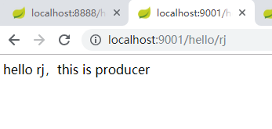
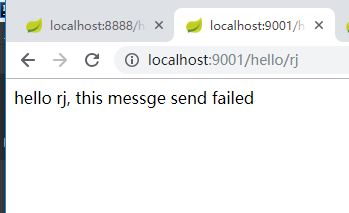
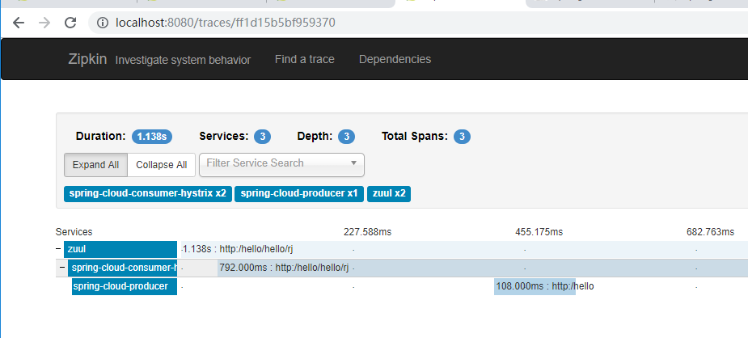
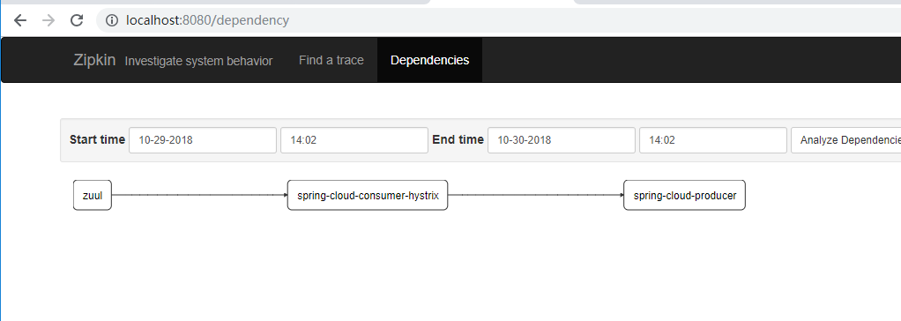

### 去eureka的springcloud脚手架
> springcloud 是一个生态健全的分布式开发框架，集合了网关/配置中心/注册中心/熔断器等，这些服务主要是java体系的服务，处于系统的异构型或者老系统的旧服务考虑，我们并不会整套都用springcloud系列，这个框架里就去除了spring 核心的 eureka，单独使用了部分服务。

- 下文中约定别名
    - gateway-service-zuul as gateway
    - spring-cloud-feign-hystrix as consumer
    - spring-cloud-producer as producer
    - zipkin-server as zipkin
- 脚手架用到的服务
    - zuul 网关
    - feign 声明式http请求
    - hystrix 熔断器
    - zipkin 服务链路跟踪

#### 启动方式
因为这里没有注册中心，四个服务随意启动起来即可，没有顺序依赖

#### 网关
gateway-service-zuul，服务主要是在配置文件中制定一些规则,也可以自定义filter实现认证

网关配置
```
server:
  port: 8888
spring:
  application:
    name: zuul
  zipkin:
    base-url: http://localhost:8080
  sleuth:
    sampler:
      percentage: 1.0
zuul:
  routes:
     hello:
        path: /hello/**
        url: http://localhost:9001/
  #开启重试
  retryable: true
  #重试次数
  MaxAutoRetries: 2
  #
  MaxAutoRetriesNextServer: 0
```
- 访问网关http://localhost:8888/hello/hello/rj
- 重定向到 http://localhost:9001/hello/rj【即consumer服务】
- consumer 访问 provider

#### 熔断
consumer服务通过feign访问provider，设置了fallback，当provider异常的时候会调用fallback里面的方法，方法里面可以实现我们的熔断逻辑

```
@FeignClient(name= "none", url = "http://localhost:9000",fallback = HelloRemoteHystrix.class)
public interface HelloRemote {

    @RequestMapping(value = "/hello")
    public String hello(@RequestParam(value = "name") String name);

}
```

- consumer 正常 调用 provider

- provider 关掉后访问


#### 服务链路跟踪

浏览器 -> consumer -> provider

zipkin ui http://localhost:8080/

- 调用链


- 关系图
